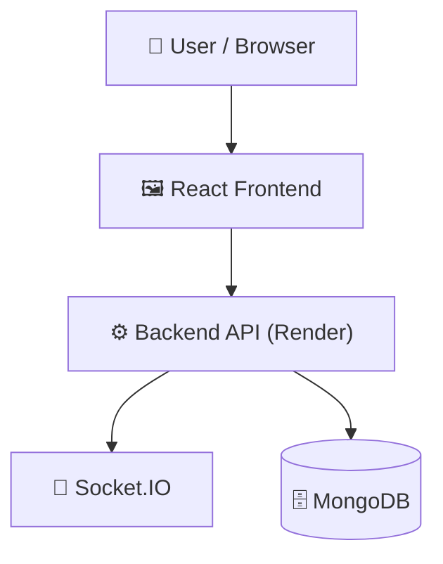

# random-chat-app


## 📑 Table of Contents

- [Description](#description)
- [Screenshots](#screenshots)
- [Tech Stack](#tech-stack)
- [Architecture](#architecture)
- [Quick Start](#quick-start)
- [Key Dependencies](#key-dependencies)
- [Available Scripts](#available-scripts)
- [API Endpoints](#api-endpoints)
- [Project Structure](#project-structure)
- [Development Setup](#development-setup)
- [Deployment](#deployment)
- [Contributors](#contributors)
- [Contributing](#contributing)

## 📝 Description

Random Chat App is a real-time anonymous messaging platform built using the MERN Stack (MongoDB, Express.js, React.js, and Node.js) with Socket.IO for instant communication.

## 📸 Screenshots


## 🛠️ Tech Stack


**Notable libraries:** Socket.IO

## 🏗️ Architecture

A high-level view of how the main pieces fit together:



## ⚡ Quick Start

### 1. Clone the Repository

```bash
git clone https://github.com/shubhamkumarmurmu/random-chat-app.git
cd random-chat-app
```

### 2. Set Up the Frontend

Navigate to the `Client` directory and install dependencies:

```bash
cd Client
npm install
```

Create a `.env` file inside the `Client` directory.

**`Client/.env`**

```env
VITE_API_URL=https://your-backend-name.onrender.com
```

Replace the example URL with your actual Render backend URL. Ensure that your Axios configuration reads `import.meta.env.VITE_API_URL`.

Start the frontend development server:

```bash
npm run dev
```

The frontend will usually be available at `http://localhost:5173`.

### 3. Set Up the Backend Locally (Optional)

If you want to run the backend locally, open a new terminal in the project root:

```bash
cd Server
npm install
```

Create a `.env` file inside the `Server` directory.

**`Server/.env`**

```env
PORT=5000
MONGO_URI=your_mongodb_connection_string
JWT_SECRET=your_secret_key
```

Replace the example values with your actual configuration. Check `Server/config/config.js` and your backend code to confirm the required environment variable names.

Start the backend:

```bash
npm run dev
```

Ensure that `Server/package.json` defines a `dev` script before running this command.

### 4. Run the Application

Keep the frontend and backend terminals running if you're running both locally.

If you're using the deployed Render backend, only the frontend needs to run locally. Make sure both Axios and Socket.IO point to your Render backend URL.

**Important:**

- Create the frontend environment file at `Client/.env`.
- Create the backend environment file at `Server/.env` only when running the backend locally.
- Set deployed backend secrets through Render's Environment settings.
- Never commit `.env` files containing secrets to GitHub.
- Vite exposes only variables prefixed with `VITE_` to frontend code. Never put private secrets in the frontend `.env` file.

## 📦 Key Dependencies

```text
@tailwindcss/vite: ^4.3.0
axios: ^1.18.0
lucide-react: ^1.21.0
react: ^19.2.6
react-dom: ^19.2.6
react-router-dom: ^7.18.0
socket.io-client: ^4.8.3
tailwindcss: ^4.3.0
```

## 🚀 Available Scripts

### Frontend (`Client`)

| Command | Description |
|---|---|
| `npm run dev` | Start the frontend development server |
| `npm run build` | Build the frontend for production |

### Backend (`Server`)

| Command | Description |
|---|---|
| `npm run dev` | Start the backend development server, if configured |

## 🌐 API Endpoints

Detected endpoints (best-effort scan):

```text
GET /
```

For the complete list of endpoints, refer to the backend route files:

- `Server/routes/auth.route.js`
- `Server/routes/chat.route.js`

## 📁 Project Structure

```text
.
├── Client
│   ├── .env
│   ├── eslint.config.js
│   ├── index.html
│   ├── package.json
│   ├── public
│   │   ├── favicon.svg
│   │   └── icons.svg
│   ├── src
│   │   ├── App.jsx
│   │   ├── api
│   │   │   └── axios.js
│   │   ├── assets
│   │   │   ├── hero.png
│   │   │   ├── react.svg
│   │   │   └── vite.svg
│   │   ├── components
│   │   │   └── ProtectedRoute.jsx
│   │   ├── context
│   │   │   ├── AuthContext.jsx
│   │   │   └── SocketContext.jsx
│   │   ├── index.css
│   │   ├── main.jsx
│   │   └── pages
│   │       ├── Auth.jsx
│   │       ├── Chat.jsx
│   │       └── Lobby.jsx
│   ├── vercel.json
│   └── vite.config.js
└── Server
    ├── .env
    ├── app.js
    ├── config
    │   ├── config.js
    │   └── database.js
    ├── controllers
    │   ├── auth.controller.js
    │   └── chat.controller.js
    ├── index.js
    ├── middlewares
    │   └── auth.middleware.js
    ├── models
    │   ├── chatsession.model.js
    │   ├── message.model.js
    │   └── user.model.js
    ├── package.json
    ├── routes
    │   ├── auth.route.js
    │   └── chat.route.js
    ├── socket
    │   └── chatSocket.js
    └── utils
        └── generateToken.js
```

## 🛠️ Development Setup

### Prerequisites

- Node.js (v18 or later recommended)
- npm
- A MongoDB instance, local or hosted, if required by the backend

### Frontend Setup

```bash
cd Client
npm install
```

Create `Client/.env` with the correct backend URL:

```env
VITE_API_URL=https://your-backend-name.onrender.com
```

Start the frontend:

```bash
npm run dev
```

### Backend Setup

```bash
cd Server
npm install
```

Create `Server/.env` and add the environment variables required by your backend.

Example:

```env
PORT=5000
MONGO_URI=your_mongodb_connection_string
JWT_SECRET=your_secret_key
```

Start the backend locally:

```bash
npm run dev
```

Run the frontend and backend in separate terminals when developing locally.

## 🚢 Deployment

### 🌐 Backend Deployment on Render

The backend is deployed on [Render](https://render.com).

To deploy your own backend:

1. Push your project to GitHub.
2. Sign in to Render and create a new **Web Service**.
3. Connect your GitHub repository.
4. Set the **Root Directory** to `Server`.
5. Configure the build and start commands:
   - **Build Command:** `npm install`
   - **Start Command:** `npm start` (requires a `start` script in `Server/package.json`).
6. Open the service's **Environment** settings and add the environment variables your backend requires, such as your MongoDB connection string and JWT secret.
7. Deploy the service and copy its public URL.

Example backend URL:

```text
https://your-backend-name.onrender.com
```

**Render deployment notes:**

- Make sure the backend listens on `process.env.PORT`.
- Ensure MongoDB is reachable from the deployed backend.
- Configure CORS to allow your deployed frontend domain.
- Configure Socket.IO to accept connections from your frontend domain.
- Set secrets in Render's Environment settings rather than committing them to GitHub.
- The backend start command must match the scripts available in `Server/package.json`.

### ⚡ Frontend Deployment on Vercel

The frontend is built with React and Vite and can be deployed on [Vercel](https://vercel.com).

To deploy the frontend:

1. Sign in to Vercel and import your GitHub repository.
2. Set the **Root Directory** to `Client`.
3. Configure the build settings:
   - **Framework Preset:** Vite
   - **Build Command:** `npm run build`
   - **Output Directory:** `dist`
4. Add the following environment variable in the Vercel project settings:

   ```env
   VITE_API_URL=https://your-backend-name.onrender.com
   ```

   Replace the example URL with your actual Render backend URL.

5. Deploy the project and open the URL provided by Vercel.

### 🔗 Production Environment Configuration

- Set backend environment variables in Render.
- Set frontend environment variables in Vercel.
- Make sure Axios uses the correct backend URL.
- Make sure Socket.IO connects to the deployed Render backend.
- Configure backend CORS for the Vercel frontend domain.
- Use HTTPS for deployed frontend and backend communication.
- Never expose database credentials, JWT secrets, or other private keys in frontend environment variables.

### 🧪 Test the Deployment

1. Open your deployed Vercel frontend.
2. Test registration and login.
3. Check whether messages are sent and received in real time.
4. Verify Socket.IO connections in the browser's developer console.
5. Check Render logs if API requests or socket connections fail.


## 👥 Contributing

Contributions are welcome! Here's the standard flow:

1. **Fork** the repository.
2. **Clone** your fork:

   ```bash
   git clone https://github.com/shubhamkumarmurmu/random-chat-app.git
   ```

3. **Create a branch:**

   ```bash
   git checkout -b feature/your-feature
   ```

4. **Commit your changes:**

   ```bash
   git commit -m "feat: add some feature"
   ```

5. **Push your branch:**

   ```bash
   git push origin feature/your-feature
   ```

6. **Open a pull request.**

Please follow the existing code style and include tests for new behavior where applicable.

---

<div align="center">


<sub>Generate beautiful READMEs in seconds → <a href="https://readmebuddy.com">readmebuddy.com</a></sub>

</div>
